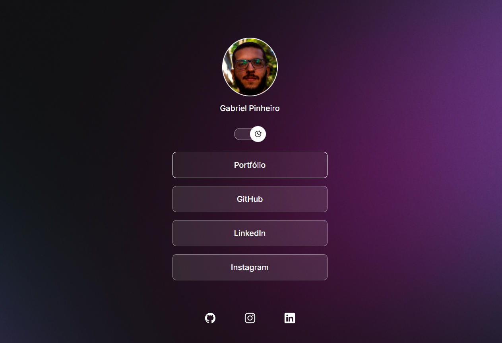

<h1 align="center"> Meu Discover </h1>

Primeiro realizado a partir de um Curso da Rocketseat.

  <a href="#-tecnologias">Tecnologias</a>&nbsp;&nbsp;&nbsp;|&nbsp;&nbsp;&nbsp;
  <a href="#-projeto">Projeto</a>&nbsp;&nbsp;&nbsp;|&nbsp;&nbsp;&nbsp;
  <a href="#-layout">Layout</a>&nbsp;&nbsp;&nbsp;|&nbsp;&nbsp;&nbsp;
  <a href="#memo-licença">Licença</a>

  

 

  

## 🚀 Tecnologias

Esse projeto foi desenvolvido com as seguintes tecnologias:

- HTML e CSS
- JavaScript
- Git e Github
- Figma

## 💻 Projeto

Meu Primeiro Projeto de Programação. Uma página que contém os meus links pessoais (Portfólio e Redes Sociais).

## 🔖 Layout

Você pode acessar o projeto através do link: (https://www.figma.com/design/JXOu0AWnRaHfq5MY3mZ3nR/DevLinks-%E2%80%A2-Projeto-Discover--Community-?node-id=10-620&p=f&t=F0M0Xza1tLe4cBAD-0). É necessário ter conta no Figma para visualizá-lo.